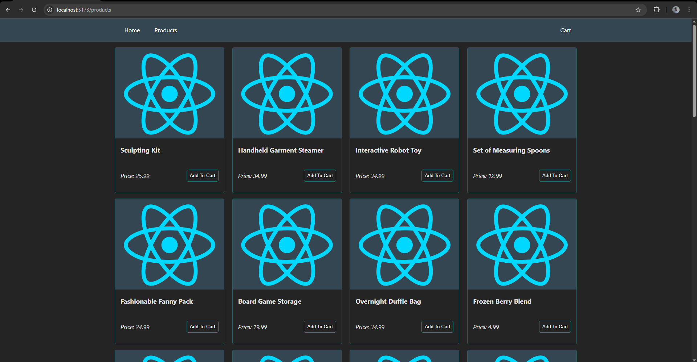
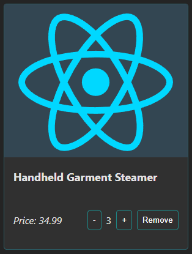
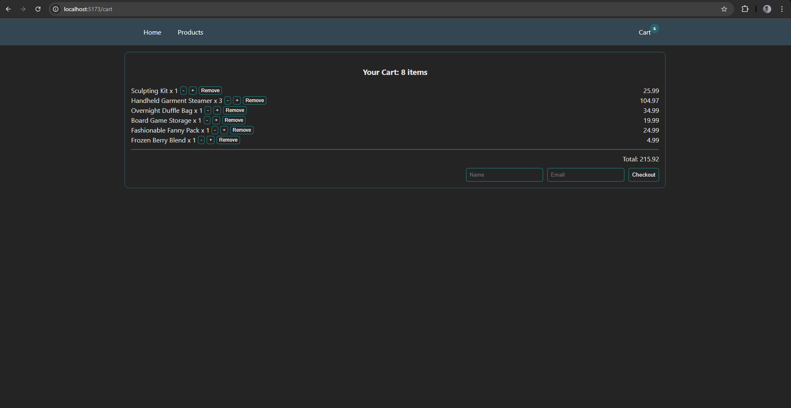
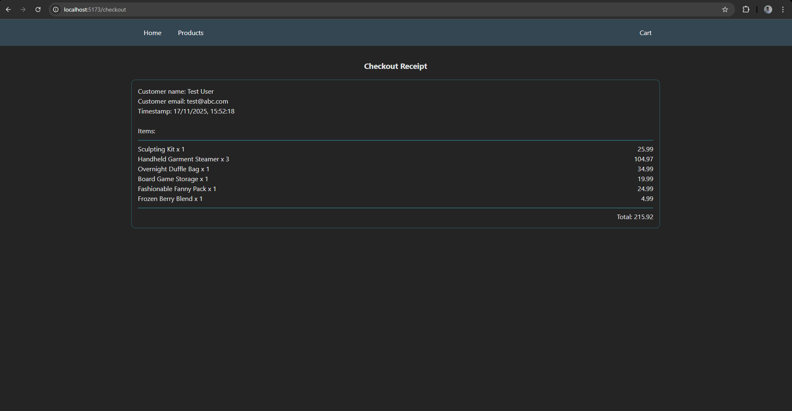

# nexora-ecom-cart
A Full Stack E-Commerce App skeleton built as part of an assignment from Nexora.

## Getting Started

1. Install Docker
2. Clone the repo
3. Navigate to the project directory and run
    ```sh
    docker compose up
    ```
4. The backend server will start on port `3000` while the frontend will start on port `5173`.
5. Navigate to [the frontend](http://localhost:5173/) to interact with the app.

Alternatively, you can build and run the frontend and the backend individually by navigating to each directory and executing `npm install` followed by `npm run dev`. The respective servers will be up on the ports specified above. Note that the frontend expects the backend API URL as an environment variable named `VITE_API_URL`.

## Backend

As requested, the backend is written in Node.js/Express + TypeScript for type safety.

It serves the following routes:

- **GET** `/api/products` : Fetches the list of all products. See [models/products.ts](./backend/src/models/product.ts) for product fields.
- **POST** `/api/cart` : Expects an item's `itemId` and `quantity`. Adds the given product and quantity to the current cart. Returns an error response if the given parameters are invalid.

> ![NOTE]
> For idempotency, the provided `quantity` value **is replaced** (not incremented). Ideally, the frontend will supply an idempotency key or identifier for consistency, upon which, the quantity can be safely incremented.

- **DELETE** `/api/cart/:id` : Removes the given item from the cart. The updated cart is returned as a response.
- **GET** `/api/cart` : Fetches the current cart item. The cart contains a list of all items along with their respective quantities. An additional `total` field is supplied summing up the total cost of all items. See [models/cart.ts](./backend/src/models/cart.ts) and [controllers/cartController.ts](./backend/src/controllers/cartController.ts) for details.
- **POST** `/api/checkout` : Checks out the current cart contents and generates a receipt. Expects `email` and `name` fields in the request body.

There is a full CRUD spec for the products API which is left there for dev purposes in case you want to try out CRUD operations on the products.

## Frontend

The frontend uses Vite + React + TypeScript (the standard template provided by `pnpm create vite@latest` with no additional modifications). Two additional dependecies were added to this config: `react-router` and `react-hook-form` to help with navigation and forms respectively. Check [package.json](./frontend/package.json) for details.

The frontend app has four pages:
- `/`: Just there to serve as a welcome page.
- `/products`: Shows a list of all products as a grid of product cards.

    The page is response with the number of columns shrinking along with window size.
    Each item can be added to the cart by clicking the "Add to Cart" button. Further, the number of items can be increased/decreased with a button to remove the item from cart altogether.
- `/cart`: Displays the current cart state with the list of items, their quantity, and price breakdown along with the total. Similar to the product page, buttons are provided to manipulate product quantity. A checkout form is at the bottom which leads to the checkout page upon successful submission.
- `/checkout`: Displays the receipt for the checked out cart with the item details and a timestamp. 